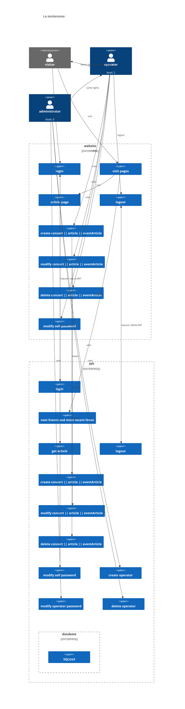
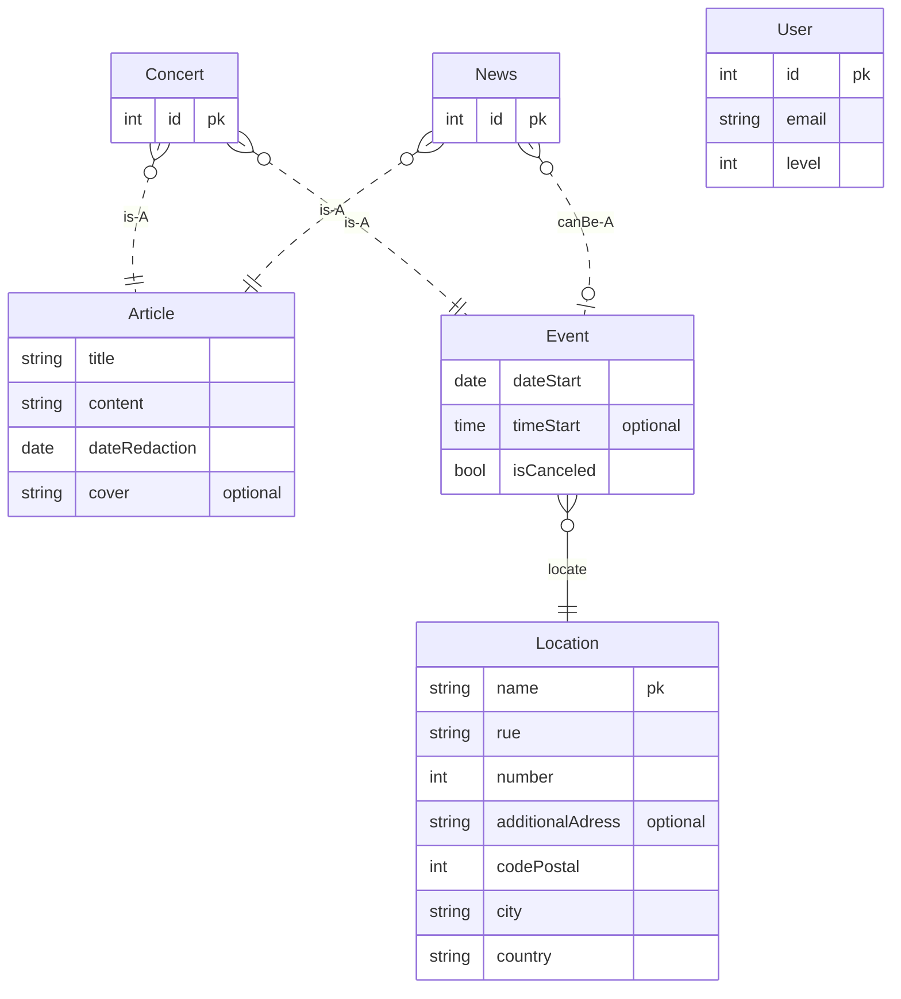

# use case

```mermaid
    C4Container
        title La stockemoise
        
        Person_Ext(vis, "visitor")
        Person(op, "operator", "level: 2")
        %%Person(mod, "moderator", "level: 1")
        Person(admin, "administrator", "level: 0")

        Enterprise_Boundary(website, "website") {
            System(login, "login")
            System(pages, "visit pages")
            System(article, "article page")
            System(logout, "logout")
            System(createFE, "create concert || article || eventArticle")
            System(modifyFE, "modify concert || article || eventArticle")
            System(deleteFE, "delete concert || article || eventArticle")
            System(changePasswordFE, "modify self password")
        }

        Enterprise_Boundary(api, "API") {
            System(loginAPI, "login")
            System(nextEvents, "next Events and most recent News")
            System(articleAPI, "get article")
            System(logoutAPI, "logout")
            System(createAPI, "create concert || article || eventArticle")
            System(modifyAPI, "modify concert || article || eventArticle")
            System(deleteAPI, "delete concert || article || eventArticle")
            System(changePasswordAPI, "modify self password")

            System(createOP, "create operator")
            System(modifyOP, "modify operator password")
            System(deleteOP, "delete operator")

            Enterprise_Boundary(db, "database") {
                System(sqlite, "SQLite3")
            }
        }

        Rel(op, vis, "Same rights except for login")
        Rel(admin, op, "same rights")

        Rel(vis, pages, "visit")
        Rel(vis, login, "login")
        Rel(op, logout, "logout")

        BiRel(login, loginAPI, "request, return JWT")
        Rel(pages, article, "visit")
        BiRel(logout, logoutAPI, "request, delete JWT")
        Rel(op, createFE, "uses")
        Rel(op, modifyFE, "uses")
        Rel(op, deleteFE, "uses")
        Rel(op, changePasswordFE, "uses")

        Rel(pages, nextEvents, "request")
        Rel(article, articleAPI, "request")
        Rel(createFE, createAPI, "create")
        Rel(modifyFE, modifyAPI, "modify")
        Rel(deleteFE, deleteAPI, "create")
        Rel(deleteFE, deleteAPI, "modify")
        Rel(changePasswordFE, changePasswordAPI, "uses")
        Rel(admin, createOP, "uses")
        Rel(admin, modifyOP, "uses")
        Rel(admin, deleteOP, "uses")

        UpdateLayoutConfig($c4ShapeInRow="3", $c4BoundaryInRow="1")

```

# Database

```mermaid
erDiagram

        Concert {
            int id "pk"
        }

        News {
            int id "pk"
        }

        Article {
            string title
            string content
            date dateRedaction
            string cover "optional"
        }
        
        Event {
            date dateStart
            time timeStart "optional"
            bool isCanceled
        }

        Location {
            string name "pk"
            string rue
            int number
            string additionalAdress "optional"
            int codePostal
            string city
            string country
        }

        Concert }o..|| Article : is-A
        News }o..|| Article : is-A
        Concert }o..|| Event : is-A
        News }o..o| Event : canBe-A
        Event }o--|| Location : locate

        User {
            int id "pk"
            string email
            int level
        }

```