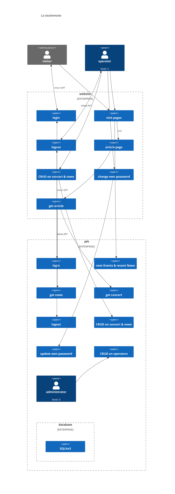
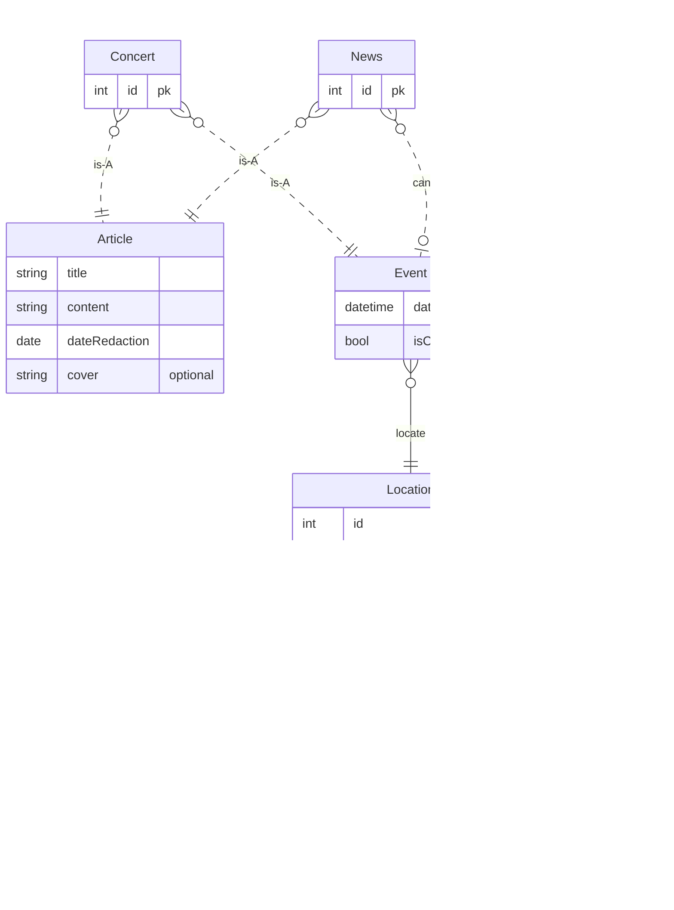

# use case

```mermaid
C4Container
    title La stockemoise
    
    Person_Ext(vis, "visitor")
    Person(op, "operator", "level: 2")
    %%Person(mod, "moderator", "level: 1")

    Enterprise_Boundary(website, "website") {
        System(login, "login")
        System(pages, "visit pages")
        System(logout, "logout")
        System(article, "article page")
        System(crudFE, "CRUD on concert & news")
        System(changePasswordFE, "change own password")
        System(articleFE, "get article")
    }

    Enterprise_Boundary(api, "API") {
        System(loginAPI, "login")
        System(nextEvents, "next Events & recent News")
        System(newsAPI, "get news")
        System(concertAPI, "get concert")
        System(logoutAPI, "logout")
        System(crudAPI, "CRUD on concert & news")
        System(changePasswordAPI, "update own password")


        System(crudOP, "CRUD on operators")

        Person(admin, "administrator", "level: 0")

        Enterprise_Boundary(db, "database") {
            System(sqlite, "SQLite3")
        }
    }

    Rel(vis, pages, "")
    Rel(op, pages, "")
    BiRel(vis, login, "return JWT")
    BiRel(op, logout, "delete JWT")

    BiRel(login, loginAPI, "return JWT")
    Rel(pages, article, "visit")
    BiRel(logout, logoutAPI, "delete JWT")
    Rel(op, changePasswordFE, "")
    Rel(op, crudFE, "")
    Rel(article, articleFE, "")

    Rel(pages, nextEvents, "")
    Rel(articleFE, newsAPI, "")
    Rel(articleFE, concertAPI, "")
    Rel(crudFE, crudAPI, "")
    Rel(changePasswordFE, changePasswordAPI, "")
    Rel(admin, crudOP, "")

    UpdateLayoutConfig($c4ShapeInRow="3", $c4BoundaryInRow="1")

```

# Database

```mermaid
erDiagram

        Concert {
            int id "pk"
        }

        News {
            int id "pk"
        }

        Article {
            string title
            string content
            date dateRedaction
            string cover "optional"
        }
        
        Event {
            datetime dateEvent
            bool isCanceled
        }

        Location {
            int id "pk"
            string name
            string street
            int number
            string additionalAddress "optional"
        }

        Locality {
            int codePostal "pk"
            string city
            string country
        }

        Concert }o..|| Article : is-A
        News }o..|| Article : is-A
        Concert }o..|| Event : is-A
        News }o..o| Event : canBe-A
        Event }o--|| Location : locate
        Location }o--|| Locality : locate

        User {
            int id "pk"
            string email
            int level
        }

```